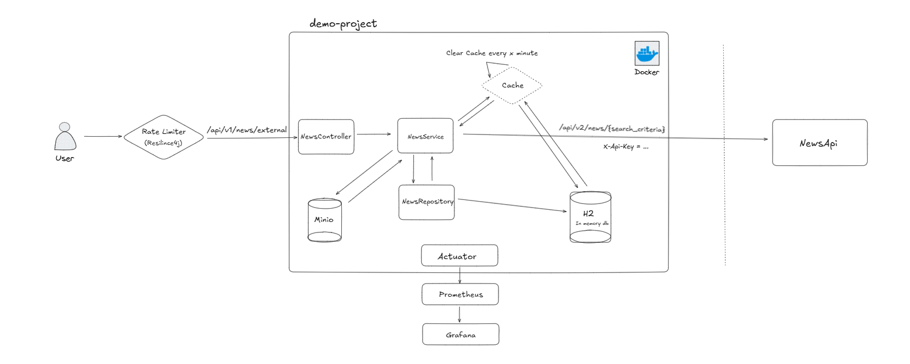

# News Handler Project

This is a project that provides CRUD operations for news and additionally allows searching from an external news API and saving the results to its own database.


### The project architecture:



## Steps to Set Up the Project:
- Add your secret-key to the application.yml file

Use the following command to run the Docker setup:
```
docker compose up -d
```
- When running the project locally, don't forget to set the active profile to dev in the application.yaml file
- Refer to the system_architecture.png file for the system design
- You can find a Postman collection in the demo-project.postman_collection.json file

### Project Requirements:
- Java 17
- Spring Boot 2
- No usage of hibaranet 

### Some explanations:

    // When saving multiple entities, I use batch saving to send a single request
    to the database
    
    // I’ve integrated an object storage system (MinIO) to store images associated with
    news items. This approach minimizes our system’s dependency on external systems,
    thereby improving overall reliability. Now, when a news item includes an image,
    it is stored in MinIO, and the database records the image path. When retrieving news,
    the image path points directly to our file storage system.
    Ex: http://localhost:8090/api/v1/news/3e09dc94/1731513250574.jpg
    
    // The getNewsByTitle() method first checks if the news exists in the database.
    If it’s not found, it sends a request to the external API. Additionally,
    caching is used, and the cache is checked first. If the news is not found in the
    cache, it queries the database.There’s also a scheduler to clean the cache periodically.
    Most properties are configurable through the application.properties file.
    
    // I added an index to the news title column for better performance. Since it's
    actively used for searching and deleting, I believe this is a good practice
    
    // Why does Source have 2 IDs?
    I don't fully trust external services to always send a unique ID. Additionally,
    it's not secure to expose the ID externally.
    
    // Why use Lombok?
    Since this is a demo project, I used Lombok to improve readability and keep the
    code clean. Some developers avoid Lombok because it can cause build-time issues.
    
    // Why no interface in the service layer?
    Since this is a simple demo project, I felt that adding interfaces was unnecessary.
    Interfaces are typically added for flexibility with future implementations,
    but in this project’s context, they seemed extraneous. Additionally, using interfaces
    without a clear purpose can sometimes be outdated practice.
    
    // Why do Error codes not in the constant file or the enum?
    I originally thought it would be better to keep the messages static,
    but then I decided to make them dynamic this time. I also want to include the field
    name in some cases in the exception message. I believe the current approach isn't the
    best solution, and I don't want to store the messages in a constants file and then
    append the field name like: NEWS_NOT_FOUND_EXCEPTION + newsName

### What Could Be Done else?
    - Unit and integration tests could be written
    
    - To manage sensitive properties securely, a solution like HashiCorp Vault or
      an .env file could be implemented. However, to keep the project’s complexity
      manageable and testing straightforward, I opted not to add these.
    
    - OpenAPI (Swagger) could be added. However, I ran into some issues while trying to add it.
      I found that the SecurityConfiguration class needs to extend WebSecurityConfigurerAdapter
      and some methods have to be implemented, which would take a lot of time. So, I decided
      not to focus on the Spring Security part
